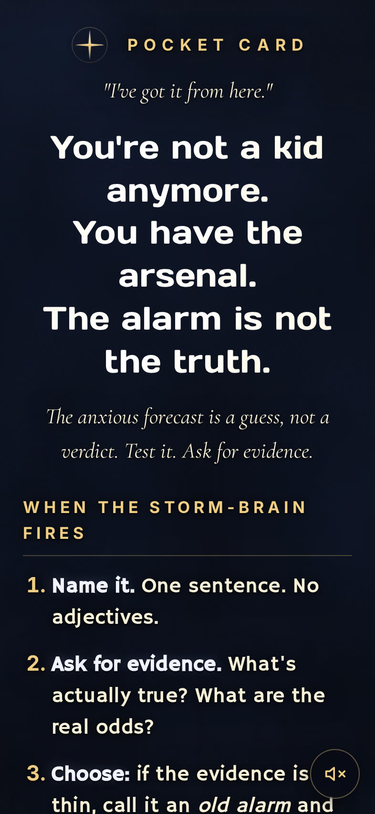

# Pocket Card

A one-page, installable pocket card for the storm-brain. Dark sky, quiet typography, a slow thunderstorm behind the text. Open it when the alarm goes off and you need a moment to set it down.

**Live site → [stewalexander-com.github.io/pocket-card](https://stewalexander-com.github.io/pocket-card/)**

<p align="center">
  
</p>

— *Accipio. Ludo.*

---

## What it is

Pocket Card is a single HTML page that reads like a letter to yourself.

- A short **mantra** you can hold onto.
- A numbered list for **when the storm-brain fires** — name it, ask for evidence, choose, log.
- A **box-breathing diagram** (4 in · 4 hold · 6 out) with a glowing dot that rides the edges so you can pace your breath.
- A nightly **Tonight** reflection prompt.
- An ambient **thunderstorm video + audio** loop (seamless, 7 s, audio off by default — tap the speaker icon bottom-right to enable).

No tracking. No accounts. No network calls after the first load. Everything is cached by a service worker so it works fully offline.

## Install it as a PWA

Pocket Card is a Progressive Web App — it installs to your home screen like a native app, runs full-screen, and works offline.

### iPhone / iPad (Safari)

1. Open [stewalexander-com.github.io/pocket-card](https://stewalexander-com.github.io/pocket-card/) in **Safari** (not Chrome — iOS only lets Safari install PWAs).
2. Tap the **Share** button at the bottom of the screen ( the square with the up-arrow ).
3. Scroll down and tap **Add to Home Screen**.
4. Confirm the name (“Pocket”) and tap **Add**.
5. Launch it from your home screen. It opens full-screen with no browser chrome. The storm and audio work offline after the first load.

> A small in-app hint box will also appear on iOS Safari to guide you through this.

### Android (Chrome, Edge, Samsung Internet)

1. Open the site in Chrome.
2. Tap the **⋮** menu → **Install app** (or **Add to Home screen**).
3. Confirm. The app installs and appears in your launcher.

### macOS / Windows / Linux (Chrome, Edge, Brave)

1. Open the site.
2. Click the **install icon** in the address bar (looks like a monitor with a down-arrow) — or **⋮ menu → Install Pocket Card**.
3. The app opens in its own window and can be pinned to the Dock / Taskbar.

## How it's built

- **Single HTML file** (`index.html`) — no framework, no build step. Tailwind-free, React-free, on purpose.
- **Google Fonts**: Coda Caption, Days One, Hammersmith One, Cormorant Garamond, Inter.
- **Procedural thunderstorm video**: [`_build/render-storm.js`](_build/render-storm.js) renders 168 frames of a 7-second seamless loop through a headless Chromium canvas, then [ffmpeg](https://ffmpeg.org) encodes mobile (720×1280) and desktop (1080×1920) H.264 MP4s. The noise is periodic (cosine-smoothed FBM) so frame 0 == frame 168 perfectly — no loop seam.
- **iOS audio unlock**: a silent MP3 primes the audio context on first user gesture; full thunder audio starts when the user taps the speaker toggle. Logic borrowed from [Rain View](https://github.com/StewAlexander-com/rain-view).
- **Service worker** (`sw.js`): cache-first with network revalidation. Version bumped per release so installed PWAs pick up updates on next launch.
- **Icons**: SVG + maskable PNGs (192/512/apple-touch) pre-rendered via CairoSVG.

## Rebuild the storm video

Requires Node.js (for Playwright) and ffmpeg.

```bash
cd _build
npm i playwright
npx playwright install chromium

# Mobile frames (720×1280)
STORM_W=720 STORM_H=1280 node render-storm.js

# Encode mobile MP4
ffmpeg -y -framerate 24 -i /tmp/storm-frames/%04d.png \
  -vf "scale=720:1280:flags=lanczos" \
  -c:v libx264 -pix_fmt yuv420p -profile:v high -level 4.0 \
  -preset slow -crf 28 -tune stillimage -movflags +faststart \
  -g 48 -keyint_min 48 -sc_threshold 0 \
  -an ../assets/storm-mobile.mp4

# Desktop frames (1080×1920)
STORM_W=1080 STORM_H=1920 node render-storm.js

# Encode desktop MP4
ffmpeg -y -framerate 24 -i /tmp/storm-frames/%04d.png \
  -vf "scale=1080:1920:flags=lanczos" \
  -c:v libx264 -pix_fmt yuv420p -profile:v high -level 4.1 \
  -preset slow -crf 25 -tune stillimage -movflags +faststart \
  -g 48 -keyint_min 48 -sc_threshold 0 \
  -an ../assets/storm-desktop.mp4
```

## Run locally

```bash
python3 -m http.server 8787
# open http://localhost:8787
```

A real server is required (not `file://`) because service workers need HTTPS or `localhost`.

## Credits

- Thunderstorm ambience: see [`AUDIO-CREDITS.txt`](AUDIO-CREDITS.txt).
- Video loop technique: adapted from [Rain View](https://github.com/StewAlexander-com/rain-view).
- The words belong to the person who needs them.

---

— *Accipio. Ludo.* —
